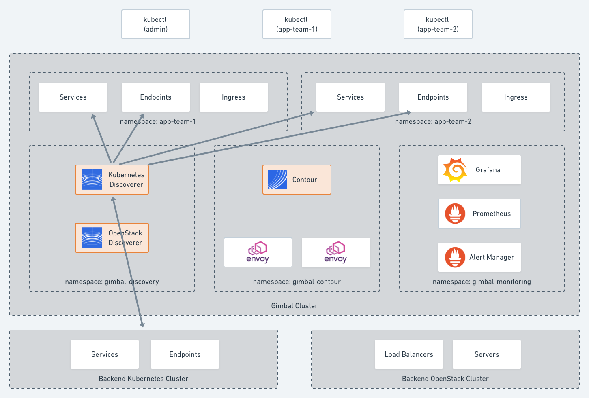
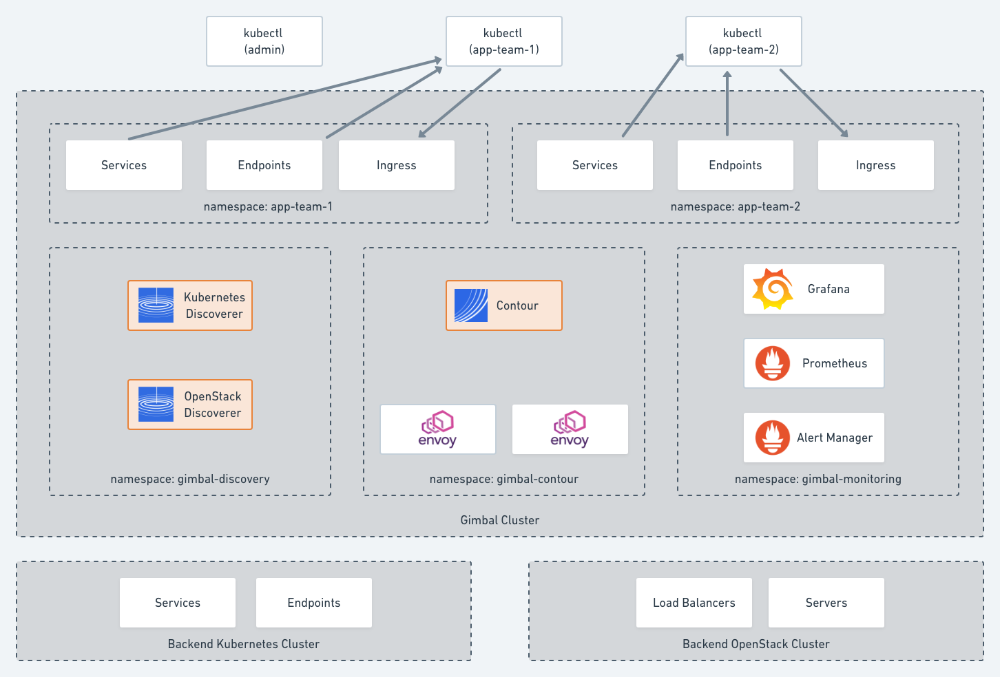
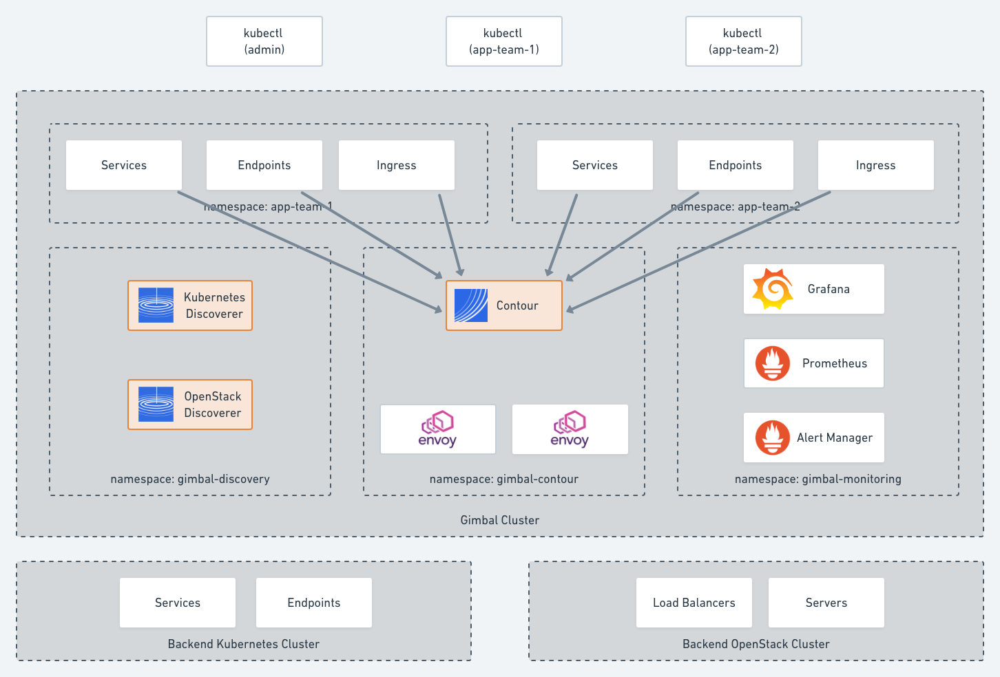
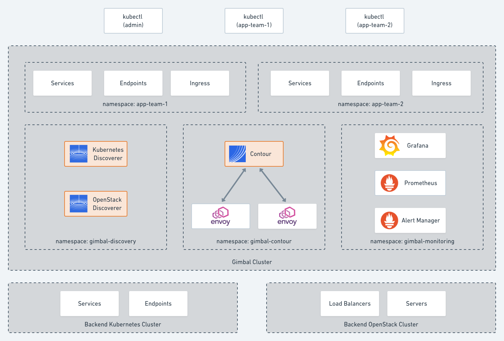

# Gimbal Architecture

## High Level

Gimbal is designed to be deployed to one or more Kubernetes clusters that will act as a load balancing tier.  These load balancing clusters will then route traffic to one or more Kubernetes or OpenStack clusters.

## Gimbal load balancing Deployment 

Cluster administrators deploy Gimbal and its dependencies to the appropriate namespaces.

* Gimbal Service discovery agents (one per upstream cluster) run in the `gimbal-discovery` namespace
* Contour and Envoy run in the `gimbal-contour` namespace
* The optional monitoring suite runs in the `gimbal-monitoring` namespace

## Gimbal Service discovery

After they are deployed, the Service Discoverers continuously collect information about upstream applications running in the Kubernetes or OpenStack clusters and create corresponding Service and Endpoint objects in the appropriate team namespaces.

For example, let's assume a namespace in Kubernetes Cluster A called `app-team-1`. Any Services and Endpoints that are discovered in Cluster A are replicated in the Gimbal cluster in the `app-team-1` namespace.  Labels associated with the Services are also replicated.

The OpenStack Discoverer provides similar behavior by monitoring all load balancers and their members. (You can think of this as LBaaS). The OpenStack load balancers are translated into Services, and the pool members are translated into Endpoints. The OpenStack tenant name becomes the cluster namespace.

## Multi-team route configuration

Development teams can see which Services are available to them by using standard Kubernetes tools like kubectl.  Services discovered by Gimbal are augmented with additional labels including the name of the cluster they were discovered which enables querying using selectors.

Developers create Kubernetes Ingress objects that define where inbound traffic (e.g. myapp.company.com) is routed.

## Contour

Contour is a Kubernetes Ingress controller for the Envoy proxy that continuously monitors Ingress, Service, and Endpoint objects in the team namespaces.

Contour provides an Envoy API compatible gRPC endpoint that dynamically modifies the Envoy route configuration.

Envoy is deployed using the host network, and provides the data plane for Gimbal. Envoy is a high-performance load balancing proxy that physically routes ingress traffic to the upstream Kubernetes and OpenStack clusters.

## Monitoring

Gimbal includes an optional monitoring addon that includes Prometheus, Alertmanager, and Grafana.

Each Gimbal system component exposes a Prometheus-compatible metrics endpoint with health status and essential metrics that are aggregated by Prometheus and can be visualized using Grafana.